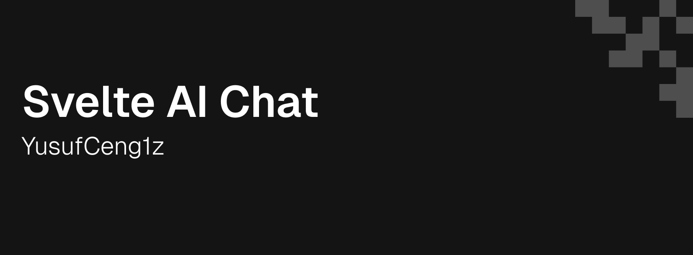

<div align="center">



# svelte-ai-chat


**A minimalist, drop-in AI chat widget for Svelte 5.**
<br/>
*Because building chat interfaces from scratch is a pain.*

[Live Demo](https://svelte-ai-chat.vercel.app) · [Report Bug](https://github.com/YusufCeng1z/svelte-ai-chat/issues)

</div>

<br/>

## What is this?

It's not a complex library you install. It's a nicely crafted component you **copy and paste** into your project (shadcn/ui style).

I wanted something that looked premium, worked perfectly on mobile, and supported streaming out of the box. So I built this using **Svelte 5 Runes** and the **Vercel AI SDK**.

## Why you might like it

- **Glassmorphism UI**: High-end look with blurs and smooth animations.
- **Mobile First**: Feels like a native app on phones (fullscreen mode).
- **Svelte 5 Ready**: Built with `$state`, `$effect`, and the new goodies.
- **AI SDK Power**: Works with OpenAI, Anthropic, Groq, or whatever you use.
- **You Own The Code**: No black-box npm packages. Customize every pixel.

---

## Get Started

### 1. The Dependencies
You just need the AI SDK and a few icons.

```bash
npm install ai @ai-sdk/svelte marked zod Lucide-svelte
```

### 2. Copy the Goods
Grab the `src/lib/components/ai-chat` folder from this repo and drop it into your codebase.

### 3. The Backend
Create a standard API route at `src/routes/api/chat/+server.ts`:

```typescript
import { streamText } from 'ai';
import { createOpenAI } from '@ai-sdk/openai';
import { env } from '$env/dynamic/private';

const openai = createOpenAI({ apiKey: env.OPENAI_API_KEY });

export const POST = async ({ request }) => {
  const { messages } = await request.json();
  const result = streamText({
    model: openai('gpt-4o'),
    messages,
  });
  return result.toUIMessageStreamResponse();
};
```

### 4. Drop it in
Now just use it like any other component.

```svelte
<script>
  import { Chat } from "$lib/components/ai-chat";
</script>

<Chat
  api="/api/chat"
  title="Assistant"
/>
```

## Support

If you find this useful, **please star the repo!** It helps more people find it.

License: MIT. Go build something cool.
